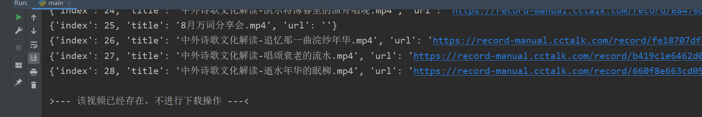
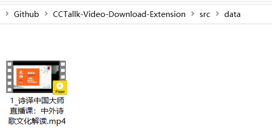

# CCTalk-Video-Download-Extension

原项目：[here200/CCTalk-Video-Download: Cctalk视频下载工具 (github.com)](https://github.com/here200/CCTalk-Video-Download)

新项目的特点

- 采用模块化的方式进行管理
- 更加易于使用。
  - 大部分功能都已经写好了，只需要简单的修改一下参数。

相较于原来的项目，新添加的功能

1. 默认会给每个下载的视频添加序号【可选，也可以不添加】
2. 已经下载过的视频，不会重新下载【会直接跳过，避免重复下载视频】
3. 不再需要手动添加 `./data/` 文件夹。

### 图片（仅供参考，以实际情况为准）

